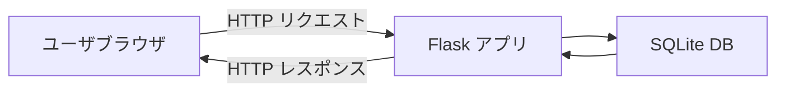

<!-- docs/architecture.md -->
# STEP 5  アーキテクチャ設計

```mermaid
graph LR
  Browser["ユーザブラウザ"]
  Flask["Flask アプリ"]
  SQLite["SQLite DB"]

  Browser -->|HTTP リクエスト| Flask
  Flask --> SQLite
  SQLite --> Flask
  Flask -->|HTTP レスポンス| Browser
```
