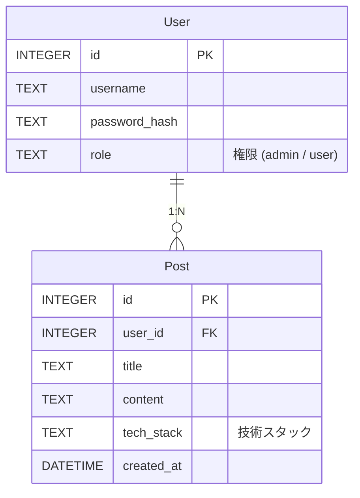

<!-- docs/database.md -->
# STEP 4  データベース設計（ER図）

```mermaid
erDiagram
  User ||--o{ Post : "1:N"

  User {
    INTEGER id PK
    TEXT username
    TEXT password_hash
    TEXT role "権限 (admin / user)"
  }

  Post {
    INTEGER id PK
    INTEGER user_id FK
    TEXT title
    TEXT content
    TEXT tech_stack "技術スタック"
    DATETIME created_at
  }
```
