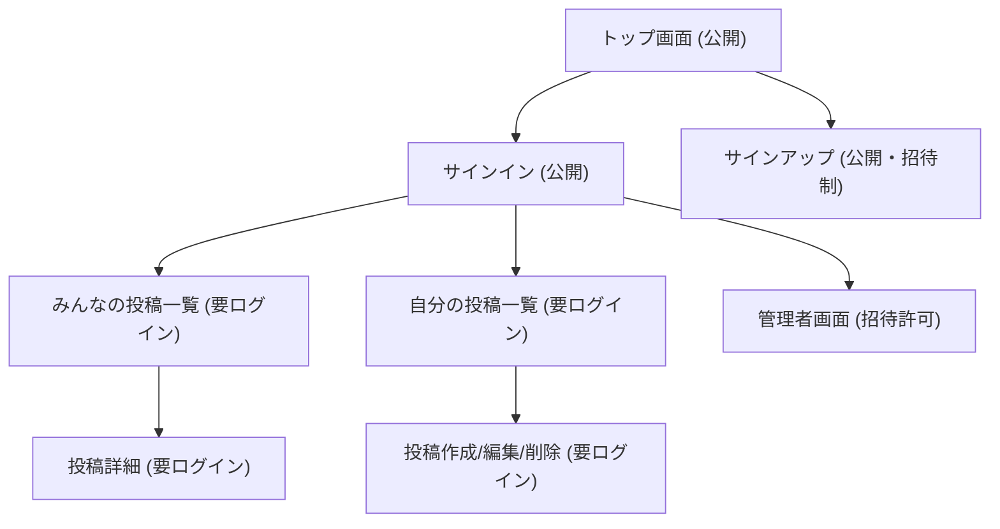

<!-- docs/screens.md -->
# STEP 3  画面設計・画面遷移図

```mermaid
graph TD
    Top["トップ画面 (公開)"] --> SignIn["サインイン (公開)"]
    Top --> SignUp["サインアップ (公開・招待制)"]

    SignIn --> AllPosts["みんなの投稿一覧 (要ログイン)"]
    SignIn --> MyPosts["自分の投稿一覧 (要ログイン)"]
    SignIn --> Admin["管理者画面 (招待許可)"]

    AllPosts --> PostDetail["投稿詳細 (要ログイン)"]
    MyPosts --> NewPost["投稿作成/編集/削除 (要ログイン)"]
```
